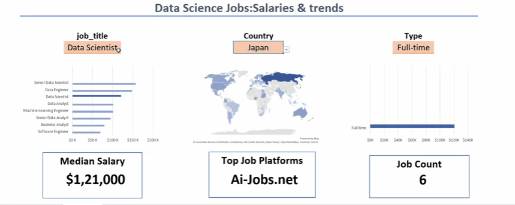
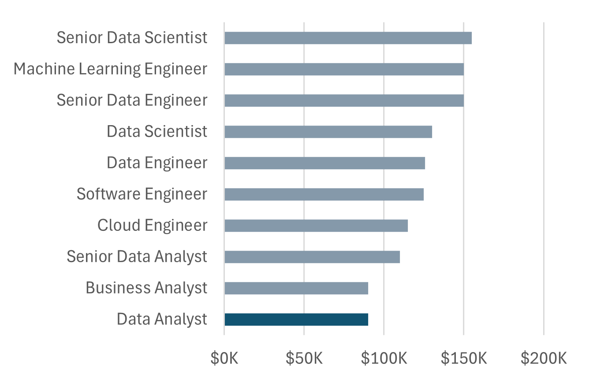
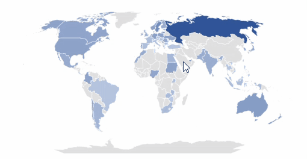
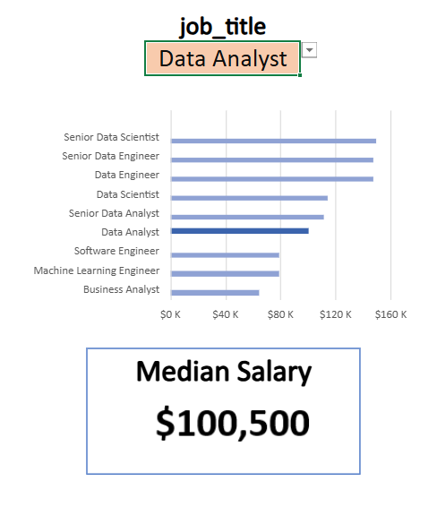
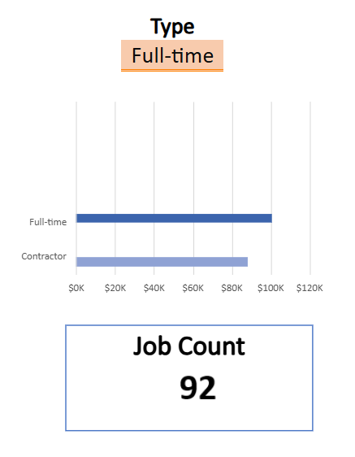
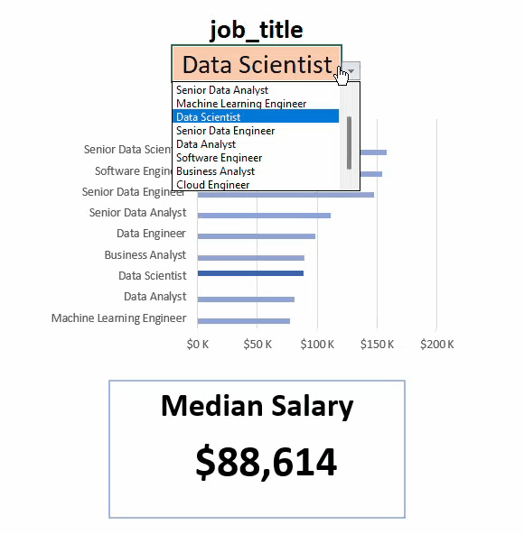

# Excel_dashboard


## Introduction
This project explores global data science job trends, analyzing salaries and job types across different locations. 
It provides insightful visualizations and dashboards to help understand the demand, pay scales, and career opportunities in data science worldwide.

### Dashboard File
My final dashboard is in[📂project_dashboard](https://github.com/AbhijitDass123/Excel_dashboard/raw/main/Asset/Excel_project.xlsx)

### Excel Skills Used
The following Excel skills were utilized for analysis:

**📉 Charts**

**🧮 Formulas and Functions**

**❎ Data Validation**

### Data Jobs Dataset
The dataset used in this project contains real-world data science job postings from 2023, with details on salaries, job types, locations, and job sources.

- 👨‍💼 **Job Titles**  
- 💰 **Salaries**  
- 📍 **Locations**  
- 🛠️ **Job Types & Sources**

### 📉 Charts
**📊 Data Science Job Salaries - Bar Chart**


## 📊 Dashboard Highlights  

- 🛠️ **Excel Features**: Used bar charts with formatted salary values and an optimized layout for better clarity.  
- 🎨 **Design Choice**: Horizontal bar charts enable clear visual comparison of median salaries.  
- 📉 **Data Organization**: Job titles are sorted in descending order of salary, making high-paying roles stand out.  
- 💡 **Insights Gained**: Analyst roles serve as a strong entry point for beginners, with clear progression into senior positions that reveal distinct salary growth trends.

**🌍 Global Salary Visualization- Map Chart**
  


- 🛠️ **Excel Features**: Leveraged Excel's map chart to plot median salaries across countries.  
- 🎨 **Design Choice**: Applied a color-coded scheme to easily distinguish salary levels by region.  
- 📊 **Data Representation**: Displayed median salary for each country with available data.  
- 👁️ **Visual Enhancement**: Enhanced readability for quick geographic comparisons.  
- 💡 **Insights Gained**: Clearly highlights global salary disparities, making it easy to spot high- and low-paying regions at a glance.

### 🧮 Formulas and Functions  

- 💰 **Median Salary by Job Titles**  
```excel
=MEDIAN(
  IF(
    (jobs[job_title_short]=A2) *
    (jobs[job_country]=country) *
    (ISNUMBER(SEARCH(type,jobs[job_schedule_type]))) *
    (jobs[salary_year_avg]<>0),
    jobs[salary_year_avg]
  )
)
```

- 🔍 **Multi-Criteria Filtering**: Evaluates job title, country, and schedule type while excluding blank or invalid salaries.  
- 📊 **Array Formula**: Leverages `MEDIAN()` with nested `IF()` conditions to process and analyze arrays of salary data.  
- 🎯 **Tailored Insights**: Generates precise salary outputs based on job title, geographic region, and work schedule type.  
- 🔢 **Formula Purpose**: Populates the salary analysis table with accurate median values filtered by the selected parameters.  

### 📉 Dashboard Implementation


### 🕒 Count of Job Schedule Type
``` excel
=FILTER(J2#,(NOT(ISNUMBER(SEARCH("and",J2#))+ISNUMBER(SEARCH(",",J2#))))*(J2#<>0))
```
- **🔍 Unique List Generation**
This Excel formula uses the FILTER() function to generate a refined list of job schedule types. It removes entries containing "and" or commas, and also excludes zero values for cleaner results.

- **🎯 Formula Purpose**
The filtered list is then used to populate the table below, providing a unique and valid set of job schedule types for analysis.

### 📉 Dashboard Implementation


## ✅ Data Validation
**🔍 Filtered List**

**🔒 Enhanced Data Validation**
By applying the filtered list as a Data Validation rule (under Job Title, Country, and Type in the Data tab), the dashboard ensures:

- **🎯 Accurate Input** – users can only select from predefined, validated schedule types
- **🚫 Error Prevention** – eliminates incorrect or inconsistent entries
- **👥 Improved Usability** – creates a cleaner and more reliable user experience

  

  ## Conclusion
  I developed this dashboard to present insights into salary trends across diverse data-related job roles. Built using datasets from my Excel course, the dashboard enables users to explore how factors such as location and job type influence compensation. Its interactive features provide a clear and practical view of the job market, helping users make more informed career decisions.
